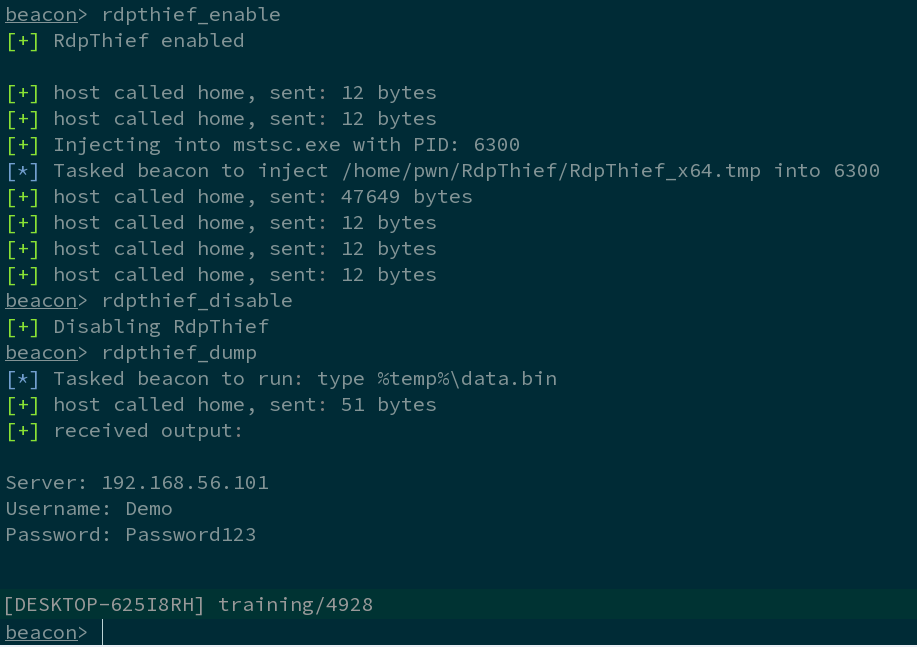

# RdpThief

RdpThief by itself is a standalone DLL that when injected in the mstsc.exe process, will perform API hooking, extract the clear-text credentials and save them to a file. 

An aggressor script accompanies it, which is responsible for managing the state, monitoring for new processes and injecting the shellcode in mstsc.exe. The DLL has been converted to shellcode using the sRDI project (https://github.com/monoxgas/sRDI). When enabled, RdpThief will get the process list every 5 seconds, search for mstsc.exe, and inject to it.

When the aggressor script is loaded on Cobalt Strike, three new commands will be available:

* rdpthief_enable – Enables the hearbeat check of new mstsc.exe processes and inject into them.
* rdpthief_disable – Disables the hearbeat check of new mstsc.exe but will not unload the already loaded DLL.
* rdpthief_dump – Prints the extracted credentials if any.

## Screenshot

Demonstration Video : https://www.youtube.com/watch?v=F77eODhkJ80

More details can be found on : https://www.mdsec.co.uk/2019/11/rdpthief-extracting-clear-text-credentials-from-remote-desktop-clients/
